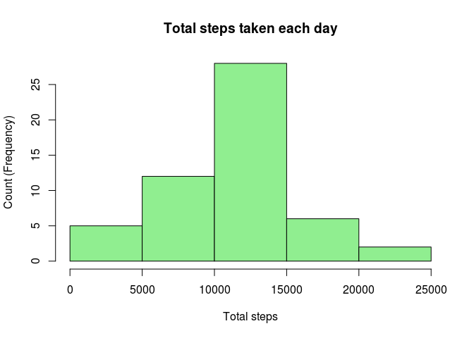
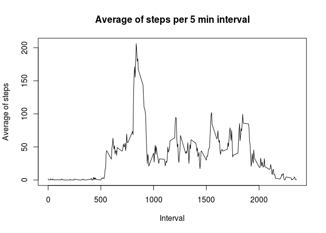
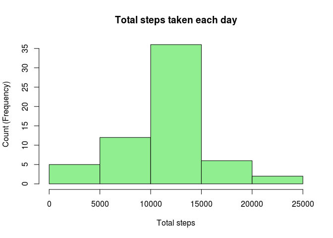
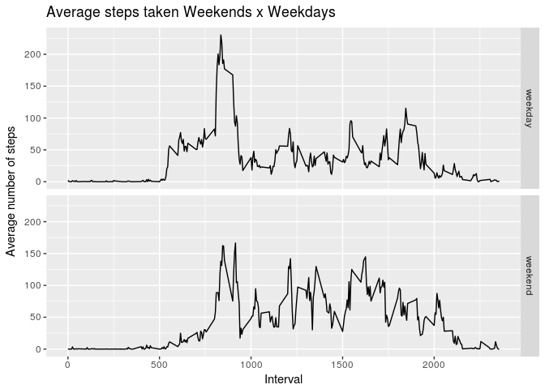

## Loading and preprocessing the data


```r
# Loads dplyr package
library(dplyr, warn.conflicts = FALSE)

# Unzip data file
activity <- unzip(zipfile = "activity.zip")

# Read data file
raw_data <- read.csv(file = activity)

# Remove NAs
data <- na.omit(raw_data)

# Convert date var from factor to date type
data$date <- as.Date(data$date)
```

## What is mean total number of steps taken per day?

```r
# Groups the data by date and summarize the total steps as "total_steps"
steps_per_day <- data %>%
  group_by(date) %>%
  summarize(total_steps = sum(steps))

# Creates a histogram
hist(steps_per_day$total_steps,
  main = "Total steps taken each day",
  xlab = "Total steps",
  ylab = "Count (Frequency)",
  col = "lightgreen")
```

<!-- -->


```r
steps_mean <- mean(steps_per_day$total_steps)
steps_median <- median(steps_per_day$total_steps)
```


```
## [1] "The mean total number of steps taken per day is 10766.1886792453"
```


```
## [1] "The median total number of steps taken per day is 10765"
```


## What is the average daily activity pattern?

```r
# Groups the data by 5 minutes interval and summarize the average number of
# steps taken in that interval
interval_averages <- data %>%
  group_by(interval) %>%
  summarize(avg_steps = mean(steps))

# Creates a plot with the average of steps per 5 minutes interval
plot(interval_averages$interval,
  interval_averages$avg_steps,
  type = "l",
  xlab = "Interval",
  ylab = "Average of steps",
  main = "Average of steps per 5 min interval")
```

<!-- -->


```r
max_number_of_steps_interval <- interval_averages$interval[which.max(interval_averages$avg_steps)]
```


```
## [1] "The max average of steps occurred during interval 835"
```

## Imputing missing values

1. Calculate and report the total number of missing values in the dataset (i.e. the total number of rows with NAs)
2. Devise a strategy for filling in all of the missing values in the dataset. The strategy does not need to be sophisticated. For example, you could use the mean/median for that day, or the mean for that 5-minute interval, etc.
3. Create a new dataset that is equal to the original dataset but with the missing data filled in.

1 - Report total NAs


```r
missing_data <- subset(raw_data, is.na(raw_data$steps))
```


```
## [1] "There are 2304 rows with missing in the raw data file"
```

2 - Fill in NAs with the average number of steps during that 5 minutes interval
over all days


```r
filled_data <- raw_data
for (i in 1:nrow(filled_data)) {
    if (is.na(filled_data$steps[i])) {
        # Find the index value for when the interval matches the average
        index <- which(filled_data$interval[i] == interval_averages$interval)
        # Assign the value to replace the NA
        filled_data$steps[i] <- interval_averages[index,]$avg_steps
    }
}

# Convert date variable to a Date
filled_data$date <- as.Date(filled_data$date)
```

4. Make a histogram of the total number of steps taken each day and Calculate and report the mean and median total number of steps taken per day. Do these values differ from the estimates from the first part of the assignment? What is the impact of imputing missing data on the estimates of the total daily number of steps?


```r
# Groups the data by date and summarize the total steps as "total_steps"
steps_per_day_2 <- filled_data %>%
  group_by(date) %>%
  summarize(total_steps = sum(steps))

# Creates a histogram
hist(steps_per_day_2$total_steps,
  main = "Total steps taken each day",
  xlab = "Total steps",
  ylab = "Count (Frequency)",
  col = "lightgreen")
```

<!-- -->


```r
filled_steps_mean <- mean(steps_per_day_2$total_steps)
filled_steps_median <- median(steps_per_day_2$total_steps)
```


```
## [1] "The mean total number of steps taken per day after filling NAs values is 10766.1886792453"
```


```
## [1] "The median total number of steps taken per day after filling NAs values is 10766.1886792453"
```

Imputing missing data made the mean and median equals. The mean value remains the same
while the median moved up a little (1,188679245).

## Are there differences in activity patterns between weekdays and weekends?

Create a new factor variable in the dataset with two levels – “weekday” and “weekend” indicating whether a given date is a weekday or weekend day.


```r
filled_data$day_of_week <- weekdays(filled_data$date)
filled_data$day_type <- "weekday"
filled_data$day_type[filled_data$day_of_week %in% c("Saturday", "Sunday")] <- "weekend"
```

Calculates the average steps taken for weekdays and weekends.


```r
# Group data by 5 minutes interval
# Summarize the average number of steps in each interval
data_day_avg <- filled_data %>%
  group_by(day_type, interval) %>%
  summarize(avg_steps = mean(steps))
```

Make a plot


```r
library(ggplot2)

qplot(interval, avg_steps, data = data_day_avg,
      geom = "line",
      xlab = "Interval",
      ylab = "Average number of steps",
      main = "Average steps taken Weekends x Weekdays",
      facets = day_type ~ .)
```

<!-- -->
